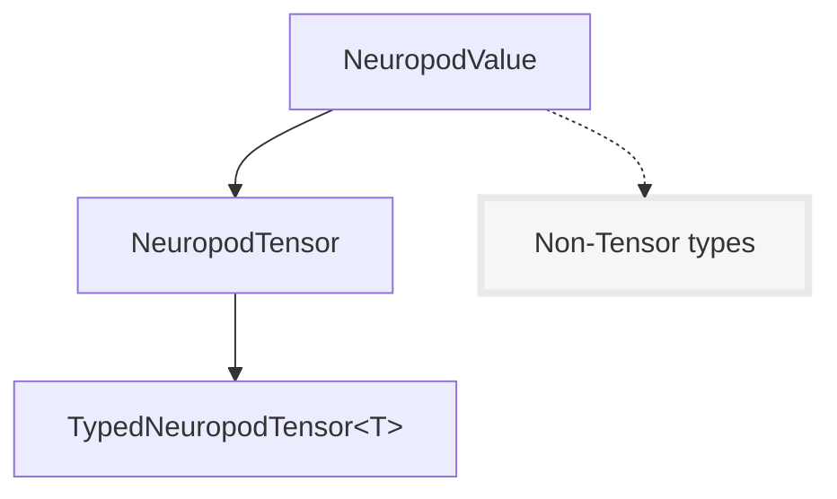

# C++ Guide

This guide walks through the Neuropod C++ API in detail and goes over many different ways of working with models.

!!! tip
    The Neuropod runtime interface is identical for all frameworks so this guide applies for models from all supported frameworks (including TensorFlow, PyTorch, Keras, and TorchScript)

## Loading a Neuropod

The simplest way to load a neuropod is as follows:

```cpp
#include "neuropod/neuropod.hh"

Neuropod neuropod(PATH_TO_MY_MODEL);
```

where `PATH_TO_MY_MODEL` is the path to a model exported using one of the packagers.

### Options

You can also provide runtime options when loading a model.

To select what device to run the model on, you can specify the `visible_device` option:

```cpp
neuropod::RuntimeOptions opts;

// Set the visible device to the first GPU
opts.visible_device = Device::GPU0;

Neuropod neuropod(PATH_TO_MY_MODEL, opts);
```

This defaults to `GPU0`. If no GPUs are available, Neuropod will attempt to fallback to CPU.

Setting `opts.visible_device = Device::CPU` will force the model to run on CPU.

For more details, see all the options [here](https://github.com/uber/neuropod/blob/master/source/neuropod/options.hh)

### Get the inputs and outputs of a model

To get the inputs and outputs of a model, you can do this:

```cpp
Neuropod neuropod(PATH_TO_MY_MODEL);

// Both of these are `std::vector<TensorSpec>`
const auto &inputs  = neuropod.get_inputs();
const auto &outputs = neuropod.get_outputs();

for (const auto &item : inputs)
{
    // A `TensorSpec` is a struct with a `name`, `dims` and `type`
    std::cout << "Tensor name: " << item.name << std::endl;
}
```

For more details, see [`TensorSpec`](https://github.com/uber/neuropod/blob/master/source/neuropod/internal/config_utils.hh#L25)

## Tensor Types

The following tensor types are supported:

- `float`
- `double`
- `string`

- `int8`
- `int16`
- `int32`
- `int64`

- `uint8`
- `uint16`
- `uint32`
- `uint64`

!!! note
    `uint16`, `uint32`, and `uint64` are not supported by PyTorch or TorchScript. See the [supported type list](https://pytorch.org/docs/stable/tensors.html) in the PyTorch documentation.


!!! note
    TorchScript does not have support for string tensors so we represent them as lists of strings. Therefore TorchScript Neuropod models only support 1D string "tensors". See [here](https://github.com/uber/neuropod/blob/master/source/python/neuropod/tests/test_torchscript_strings.py) for example usage.

## Creating tensors

!!! tip
    See the Efficient Tensor Creation page for a guide on the approach that best fits your use case.

There are many different ways to create `NeuropodTensor`s, but all of them start with an `allocator`.

To get an allocator for a loaded model, you can do something like:

```cpp
Neuropod neuropod(PATH_TO_MY_MODEL);

auto allocator = neuropod.get_tensor_allocator();
```

For scenarios where a model isn't loaded (e.g. unit tests), you can use a generic tensor allocator:

```cpp
#include "neuropod/core/generic_tensor.hh"

auto allocator = neuropod::get_generic_tensor_allocator();
```

### Allocate new memory

For this, we just need the dimensions and type of the tensor we want to allocate.

```cpp
auto tensor = allocator->allocate_tensor<float>({1, 2, 3});
```

You can also manually specify the type without using a templated function

```cpp
auto tensor = allocator->allocate_tensor({1, 2, 3}, neuropod::FLOAT_TENSOR);
```

To do something useful with these tensors, see the [Interacting with Tensors](#interacting-with-tensors) section below.

### From existing memory

Neuropod provides a way to wrap existing memory and use it in a zero-copy way.

To do this, it needs four things:

- The dimension of the tensor to create
- The type of tensor to create
- A pointer to the data to wrap
    - Note: this should be 64 byte aligned
- A deleter function

This deleter function is called once Neuropod (and the underlying libraries) are done using this data. Until this function is called, it is not safe to deallocate the data.

It is very important to pass in a correct deleter to make sure the memory doesn't get prematurely deallocated. Some examples are below.

#### cv::Mat

```cpp
cv::Mat image = ... // An image from somewhere
auto tensor = allocator->tensor_from_memory<uint8_t>(
    // Dimensions
    {1, image.rows, image.cols, image.channels()},

    // Data
    image.data,

    // Deleter
    [image](void * unused) {
        // By capturing `image` in this deleter, we ensure
        // that the underlying data does not get deallocated
        // before we're done with the tensor.
    }
);
```

!!! tip
    You can also specify the type without using a templated function

    ```cpp
    cv::Mat image = ... // An image from somewhere
    auto tensor = allocator->tensor_from_memory(
        // Dimensions
        {1, image.rows, image.cols, image.channels()},

        // Tensor Type
        get_tensor_type_from_cv_mat(image),

        // Data
        image.data,

        // Deleter
        [image](void * unused) {}
    );
    ```

!!! note
    Utilities for wrapping types from common libraries will be added in a future release.

#### Eigen

```cpp
#include "neuropod/conversions/eigen.hh"

auto tensor = allocator->allocate_tensor<float>({1, 2, 3});

// Returns an `Eigen::Map`
auto eigen_map = neuropod::as_eigen(*tensor);
```

See [the Eigen docs](https://eigen.tuxfamily.org/dox/group__TutorialMapClass.html) for more details.

!!! note
    If you're not using the features of Eigen and just need simple element access, use [accessors](#directly-setget-data) instead.

### Factory functions

These functions are useful for creating test data.

#### zeros

Returns a tensor of type `T` and shape `input_dims` filled with zeros

```cpp
auto zeros = allocator->zeros<T>(input_dims);
```

#### ones

Returns a tensor of type `T` and shape `input_dims` filled with ones

```cpp
auto ones = allocator->ones<T>(input_dims);
```

#### full

Returns a tensor of type `T` and shape `input_dims` filled with `fill_value`

```cpp
auto full = allocator->full<T>(input_dims, fill_value);
```

#### randn

Returns a tensor of type `T` and shape `input_dims` filled with random numbers from a normal distribution with mean `mean` and standard deviation `stddev`.

```cpp
auto full = allocator->randn<T>(input_dims, mean = 0, stddev = 1);
```

#### arange

Returns a 1D tensor of type `T` containing a sequence of numbers starting at `start` with a step size of `step`.

```cpp
auto range1 = allocator->arange<T>(end);
auto range2 = allocator->arange<T>(start, end, step = 1);
```

Example:

```cpp
// 0, 1, 2, 3, 4
auto range1 = allocator->arange<float>(5);

// 2, 3, 4, 5
auto range2 = allocator->arange<float>(2, 6);

// 0, 2, 4, 6, 8
auto range3 = allocator->arange<float>(0, 10, 2);
```

#### eye

Returns an identity matrix of type `T` and shape (`M`, `N`). This matrix has ones on the diagonal and zeros everywhere else.

```cpp
auto eye1 = allocator->eye<T>(M, N);
```

Example:

```cpp
// 1, 0, 0, 0,
// 0, 1, 0, 0,
// 0, 0, 1, 0,
// 0, 0, 0, 1
auto eye1 = allocator->eye<float>(4, 4);

// 1, 0, 0, 0, 0, 0, 0,
// 0, 1, 0, 0, 0, 0, 0,
// 0, 0, 1, 0, 0, 0, 0
auto eye2 = allocator->eye<float>(3, 7);
```


## Interacting with Tensors

This section goes over various ways of interacting with existing tensors.

#### Types of tensors

Neuropod has a few different ways of representing tensors: `NeuropodValue`, `NeuropodTensor`, and `TypedNeuropodTensor<T>`

- `NeuropodValue` is the base type and represents any value that the library can store and pass around.

- A `NeuropodTensor` is a `NeuropodValue` that is a tensor. This adds metadata functionality (dimensions, type, num elements, etc.), but does not allow data access.

- A `TypedNeuropodTensor<T>` is a `NeuropodTensor` of a specific type. This level of the hierarchy adds type-safe data access.

This is what the class hierarchy looks like:



To convert from a `NeuropodValue` to a `NeuropodTensor`, you can use `as_tensor()`.

```cpp
auto my_value = ...
auto my_tensor = my_value->as_tensor();
```

To convert from a `NeuropodValue` or `NeuropodTensor` to a `TypedNeuropodTensor` of a specific type, you can use `as_typed_tensor<T>()`. This does a type-checked downcast to the requested type and throws an error if the requested type does not match the actual type of the tensor.

```cpp
auto my_value = ...
auto my_float_tensor = my_value->as_typed_tensor<float>();

// This will throw an error
auto my_uint_tensor = my_value->as_typed_tensor<uint8_t>();
```

The sections below will go over some more usage and examples.

!!! note
    Most use cases will not require usage of these methods (as the factories and templated allocators already return `TypedNeuropodTensor`s).

!!! tip
    Generally, data access requires a `TypedNeuropodTensor<T>` and metadata access requires at least a `NeuropodTensor`

#### Copy data into a tensor

<small>Requires `TypedNeuropodTensor<T>`</small>

If you want to copy in data (and can't wrap it using the `tensor_from_memory` API above), you can do something like this:

```cpp
float * my_data = ...;
size_t num_elements = ...;
tensor->copy_from(my_data, num_elements);
```

You can also copy data from a vector:

```cpp
std::vector<float> my_data;
tensor->copy_from(my_data);
```

#### Directly set/get data

<small>Requires `TypedNeuropodTensor<T>`</small>

You can do this using the accessor interface, which is very similar to PyTorch's accessor interface.

```cpp
auto tensor = allocator->allocate_tensor<float>({6, 6});

// 2 is the number of dimensions of this tensor
auto accessor = tensor->accessor<2>();
accessor[5][3] = 1.0;
```

Range-based for loops work with accessors as well:

```cpp
auto tensor = allocator->allocate_tensor<float>({3, 5});

// 2 is the number of dimensions of this tensor
auto accessor = tensor->accessor<2>();

for (const auto &row : accessor)
{
    for (const auto &item : row)
    {
        // Do something
    }
}
```

Example with string tensors:

```cpp
auto tensor = allocator->allocate_tensor<std::string>({3, 5});

// 2 is the number of dimensions of this tensor
auto accessor = tensor->accessor<2>();

for (int i = 0; i < 3; i++)
{
    for (int j = 0; j < 5; j++)
    {
        accessor[i][j] = std::to_string(i * 5 + j);
    }
}
```

Individual element access with accessors is very efficient and [comparable to raw pointer](https://github.com/uber/neuropod/blob/master/source/neuropod/tests/benchmark_accessor.cc) operations during an optimized build.

!!! note
    See the Efficient Tensor Creation page for a guide on the approach that best fits your use case. Using

#### Get the dimensions of a tensor

<small>Requires `NeuropodTensor`</small>

```cpp
const auto &dims = tensor->get_dims();
```

#### Get the number of elements in a tensor

<small>Requires `NeuropodTensor`</small>

```cpp
auto num_elements = tensor->get_num_elements();
```

#### Get the type of a tensor

<small>Requires `NeuropodTensor`</small>

```cpp
auto tensor_type = tensor->get_tensor_type();
```

#### Get a raw pointer to the underlying data

<small>Requires `TypedNeuropodTensor<T>`</small>

```cpp
auto data = tensor->get_raw_data_ptr();
```

!!! note
    This method does not work for String tensors. Use [accessors](#directly-setget-data) instead

#### Get the data as a vector

<small>Requires `TypedNeuropodTensor<T>`</small>

```cpp
auto data = tensor->get_data_as_vector();
```

!!! warning
    This method performs a copy


## Inference

The basic inference method of a neuropod looks like this:

```cpp
std::unique_ptr<NeuropodValueMap> infer(const NeuropodValueMap &inputs);
```

A `NeuropodValueMap` is just a map from `std::string` to `std::shared_ptr<NeuropodValue>`

Interacting with it is identical to interacting with a `std::unordered_map`.

For example:

```cpp
// Get an allocator
auto alloctor = neuropod.get_tensor_allocator();

// Create some tensors
auto x = allocator->randn<float>({5, 5});
auto y = allocator->ones<float>({5, 5});

// Run inference
const auto output_data = neuropod.infer({
    {"x", x},
    {"y", y}
});

// Get the outputs
auto z = output_data->at("z")->as_typed_tensor<float>();
```

You can also get a subset of the model's output by providing a list of requested outputs:

```cpp
std::unique_ptr<NeuropodValueMap> infer(const NeuropodValueMap &inputs, const std::vector<std::string> requested_outputs);
```

For example, if you wanted to return a map containing only the tensor "z", you could do this:

```cpp
const auto output_data = neuropod.infer(input_data, {"z"});
```

## Serialization

All built-in `NeuropodValue` types are serializable. Furthermore, `NeuropodValueMap` is also serializable.

```cpp
// A stream to serialize to. Any ostream is allowed, but we use a
// stringstream in this example
std::stringstream ss;

neuropod::NeuropodValueMap data = ...;
neuropod::serialize(my_stream, data);
```

Similarly, deserializing is just as easy.

```cpp
auto deserialized = neuropod::deserialize<neuropod::NeuropodValueMap>(ss, allocator);
```

!!! note
    Serialization and deserialization works across Python and C++. See the Python bindings docs for more

!!! warning
    The goal for this API is to support transient serialization. There are no guarantees about backwards compatibility so this API should not be used for long term storage of data
